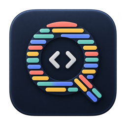
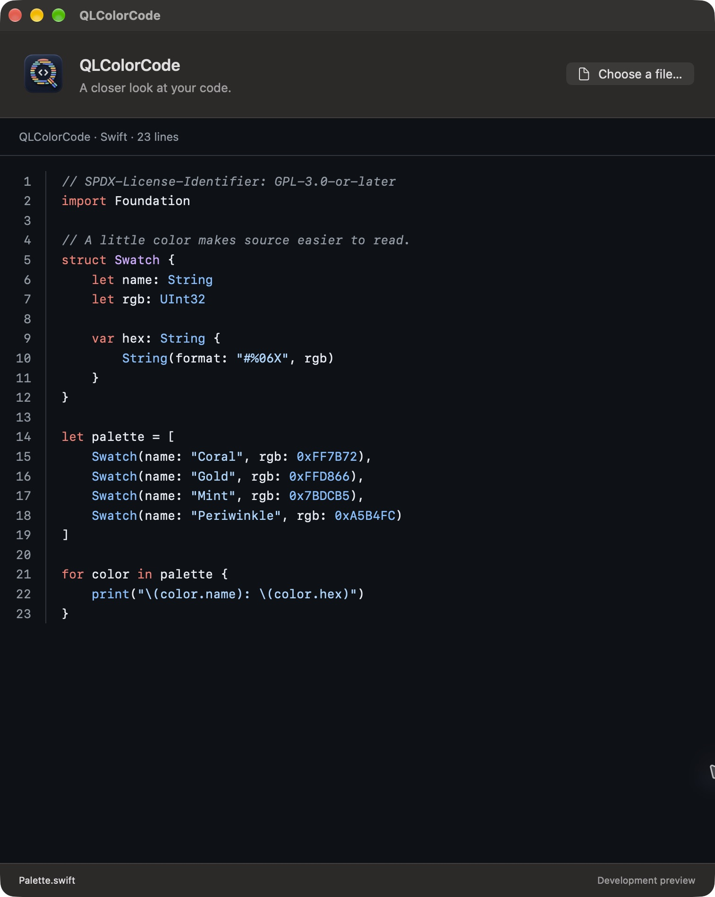

<p align="center">
  
</p>
<h1 align="center">QLColorCode</h1>
<p align="center"><strong>A closer look at your code.</strong><br>Source previews since 2007. Rebuilt for modern macOS.</p>
<p align="center">
  <a href="#try-the-development-preview">Get started</a> ·
  <a href="CONTRIBUTING.md">Contribute</a> ·
  <a href="docs/ROADMAP.md">Roadmap</a> ·
  <a href="https://github.com/masonjames/QLColorCode/issues/new/choose">Report a bug</a>
</p>

Select a source file in Finder, press **Space**, and read it in color. QLColorCode
brings syntax highlighting, original line numbers and automatic wrapping to
Quick Look, with a small companion app for trying previews and setting up the extension.

> **Development preview — build from source.** There is no signed, notarized
> download yet. This revival targets **macOS Sequoia 15 and newer**; current local
> runtime evidence is from Golden Gate 27.0.1 on Apple Silicon. It is not an
> official successor or a replacement distributed by Homebrew.



*An actual development companion preview of [Palette.swift](examples/Palette.swift),
not a mockup. Finder uses the same renderer.*

## Small utility, thoughtful defaults

- **Read the source.** Syntax colors, selectable text and original line numbers.
- **Let long lines wrap.** The gutter follows logical lines as the window changes size.
- **Match your Mac.** Automatic light and dark colors; no theme setup required.
- **Keep previews local.** Bundled grammars, no content downloads or source execution.
- **Know when a preview is partial.** Large files have bounded previews with a visible notice.

## Try the development preview

You'll need a Mac with **macOS 15+**, **full Xcode with Swift 6**, and its command-line
tools selected. No package manager or XcodeGen is needed for an ordinary build.
The current toolchain verified by this fork is Xcode 27; older toolchains still
need qualification.

```sh
git clone https://github.com/masonjames/QLColorCode.git
cd QLColorCode
bash scripts/test-modern.sh
bash scripts/test-preview-layout.sh
bash scripts/build-modern.sh
```

The app is built at `build/modern/Build/Products/Debug/QLColorCode.app`. You can also
open `modern/QLColorCodeModern.xcodeproj` in Xcode. See the
[development guide](docs/DEVELOPMENT.md) for tool selection, signing and local trials.

**A successful build is not an install.** The default build uses ad hoc signing;
macOS may refuse to run its extension. Finder testing needs a suitably signed app
and an enabled Quick Look extension. Follow the [local-trial guide](docs/LOCAL-TRIAL.md)
without disabling Gatekeeper or changing unrelated providers. In a working
companion app, choose `examples/Palette.swift` to start with a safe sample.

The old `brew install --cask qlcolorcode` package is
[disabled](https://formulae.brew.sh/cask/qlcolorcode) and does not install this fork.
The [release guide](docs/RELEASING.md) describes free DMG downloads and the
planned `masonjames/tap` route. Both will use the same notarized artifact. No new
Homebrew installation command is live yet.

## What works, and what needs help

| Area | Current evidence |
| --- | --- |
| Renderer | Core and real WebKit checks cover Unicode, wrapping, selection, multiline tokens, large files and safe fallback |
| Golden Gate 27.0.1 / Apple Silicon | Signed companion tested; earlier installed extension exercised in Finder |
| Sequoia 15 / Tahoe 26 / Intel | Build targets are present; runtime qualification is still needed |
| TypeScript | Companion can render it; `.tsx` worked in the Finder trial, while `.ts` conflicts with a macOS video type |
| Distribution | No notarized download, published tap or official successor designation |
| Release automation | Local Dagger checks and native macOS packaging; no GitHub Actions dependency |

The [release roadmap](docs/ROADMAP.md) tracks the remaining work. The
[verification record](docs/REVIEW-EVIDENCE.md) separates builds, runtime tests,
installed versions and untested cases.

The modern renderer currently uses a pinned [highlight.js](modern/Resources/PROVENANCE.md)
bundle. Legacy Highlight themes, flags, plugins and thumbnails are not carried
forward. Reads are capped at 256 KiB and 6,000 lines; highlighting has tighter
limits and falls back to plain text. A hard grammar-execution deadline remains a
release gate. See [architecture and limitations](docs/DEVELOPMENT.md#architecture-and-limits).

## Help keep a useful little project alive

A clear bug report, a small fixture, a macOS compatibility check, or a focused
pull request all help. Start with [CONTRIBUTING.md](CONTRIBUTING.md). You don't need
to tackle the whole revival to contribute something useful.

For a security concern, use the [private reporting instructions](SECURITY.md).
For the path toward Homebrew, see the [successor readiness notes](docs/SUCCESSOR.md).

## History since 2007, preserved

This fork continues [Nathaniel Gray's original QLColorCode](https://github.com/n8gray/QLColorCode),
[Derzzle's build work](https://github.com/derzzle/QLColorCode), and
[Anthony Gelibert's continuation](https://github.com/anthonygelibert/QLColorCode).
Their Git history and contributor credits remain intact. The modern Swift work
is maintained here by [Mason James](https://github.com/masonjames).

Read the [historical review](docs/REVIVAL-REVIEW.md) or the
[preserved legacy documentation](docs/LEGACY.md). Prism Q is our new identity;
it does not imply endorsement by previous maintainers, Apple or Homebrew.

## License

[GNU GPL v3](COPYING); new Swift contributions are GPL-3.0-or-later. The original
project used GPL v2 before the upstream license-file change in 2016. Existing
copyright notices are retained. The bundled highlight.js library is BSD-3-Clause,
and its [license](modern/Resources/highlight-LICENSE) ships with both app bundles.
